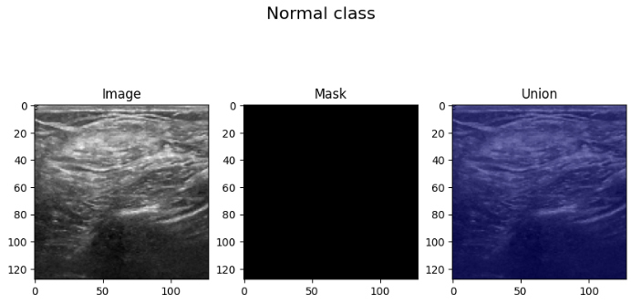
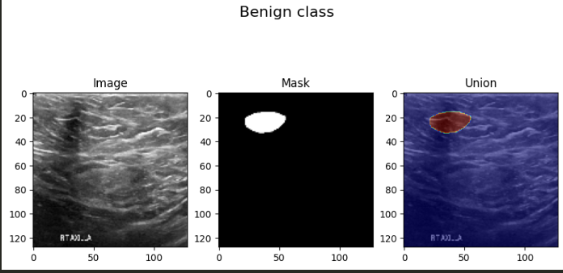
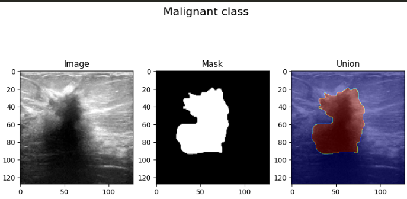
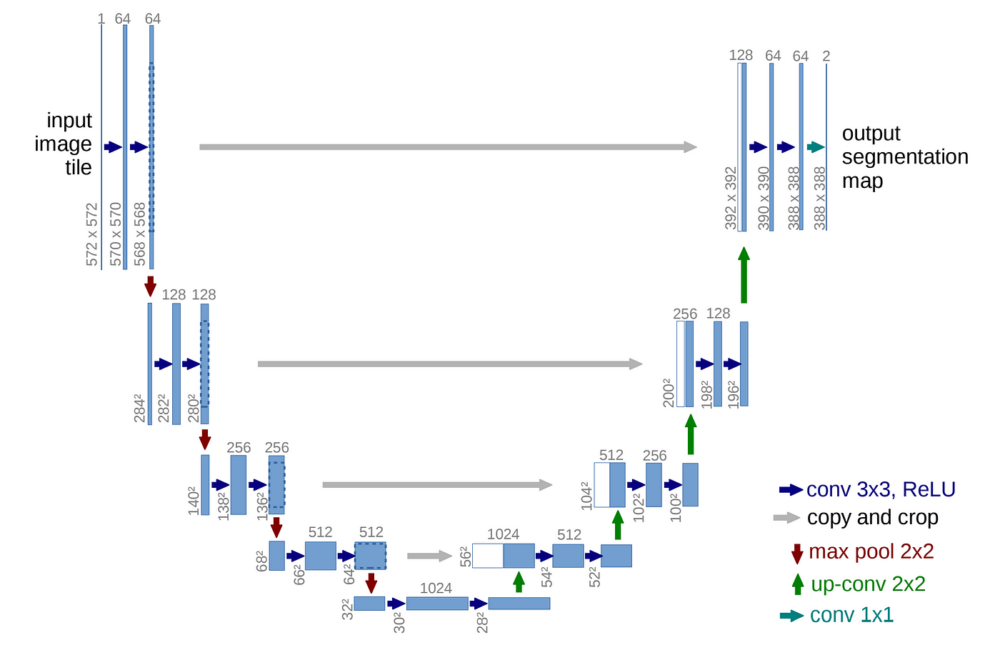
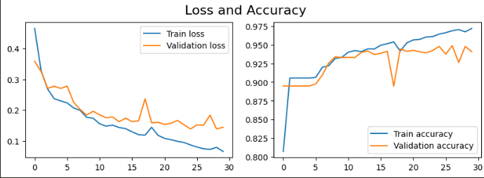
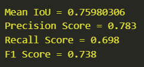
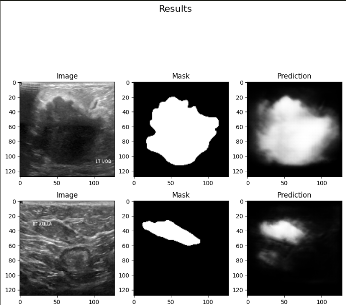

# U-Net segmentation for Breast Ultrasound Images Dataset
---
### author: 김성현
### Date: 2024.05.13. ~ 2024.05.26.
### dataset: Breast Ultrasound Images dataset(BUSI)
---
#### [dataset]: 정상(normal), 양성종양(benign), 악성종양(malignant) 3개 카테고리 존재

---
#### Using model: U-net

---
#### training result

